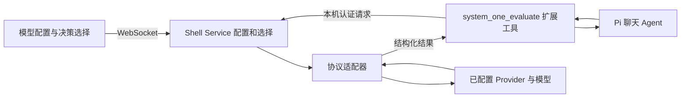

# System One 通用模型与 Provider 接入方案

日期：2026-10-02。状态：设计草案，待实施；本文不代表功能已经可用。
目标分支：`feat_system_one`；代码基线：本地 `main` / `0751444`。

## 1. 用户目标与验收标准

用户在现有“模型与服务商”入口配置服务商地址、凭据和模型，即可选择当前使用的 System One 模型。新增相同协议的服务商或模型只需配置，切换只改变绑定，不修改业务代码、不重启聊天进程。聊天 Agent 通过同一工具提出有限问题并获得结构化结果。

验收标准：

- 能创建两个同协议 provider 实例，分别配置 Jev 云端和本地 Laya/Kev；独立鉴权，名称修改不改变标识。
- 能在一个 OpenRouter provider 下添加多种决策模型，按 provider 分组选择；相同 model ID 在不同 provider 下互不覆盖。
- 切换后，下一次工具调用使用新模型；已经发出的请求保持原配置快照。界面显示实际调用的 provider、model 和配置版本。
- 只支持 choice 的模型不能接收 score/noul；无概率模型不产生虚假 confidence；不同置信度定义得到保留。
- 配置错误、缺 key、网络故障、响应不合法均明确失败，不伪造答案或默默改用其他供应商。
- 升级前的聊天配置、聊天选择、Pi models.json/auth.json 和会话格式继续可用。

非目标：训练或启动本地推理服务、自动挑选聊天模型、自动执行高风险动作、自动跨供应商降级、任意脚本/JSONPath 协议映射、一次支持所有新模型、迁移已有聊天 provider。需要新协议时仍需增加适配器；“通用”指业务契约统一及同协议配置接入。

## 2. 现有代码事实

- `shell-service/src/models-config.ts` 的 PiApi 及校验器接受四种聊天 API；未知 API 会导致配置校验失败。
- `commands/provider.ts` 保存原生 Pi models.json/auth.json，并调用 `liveSessions.disposeAll()`；该流程不适用于仅切换决策后端。
- `credential-store.ts` 当前使用 Pi 的 auth.json（API key 或引用），不是系统 Keychain。新设计不能声称现有密钥已加密。
- `provider-probe.ts` 是 GET 可达性检查，不能证明问题 schema 可被模型执行。
- `pi-adapter/manager.ts` 当前按 cwd 管理一个 PiAdapter，不能假定每个 UI 会话都有独立进程。
- `commands/extension.ts` 支持本地扩展配置；协议源在 Shell Service，前端镜像由 `scripts/sync-protocol.mjs` 生成。

因此复用“模型配置”产品入口和必要文件读写工具，新增决策契约及路由；不将 `systemone` 填入 Pi 的聊天 API 枚举。

## 3. 三个核心概念

| 概念 | 负责什么 | 示例 |
| --- | --- | --- |
| Provider 实例 | 一个独立服务连接；协议、endpoint、鉴权、超时 | 公司 Jev 账号、本地 Laya、个人 OpenRouter |
| Model 配置 | provider 下的远端模型名、显示名、能力与限制 | `jev-latest`、`jaredpalmer/kev-4b` |
| 决策模型选择 | 引用一个稳定 model 配置 ID | 全局默认；当前项目临时覆盖 |

Provider 的品牌/预设不等于调用协议。TypeSafe 和本地服务均可使用 `systemone-http`；同一个品牌也可能提供多种协议。新 provider/model 标识由服务端生成 UUID，编辑时保留；远端 model 名作为普通字符串保存，允许大小写、`/`、`:`、`~`，不从名称生成 ID，不以拼接字符串解析身份。

UI 统一按 provider 展示聊天与决策模型；API 内部使用有 kind 标签的联合类型或独立集合，防止把决策模型传给 `set_model`。已有聊天类型暂不做大规模重构。

## 4. 持久化与配置示例

新配置放在 `<getAgentDir()>/pi-ui/system-one.json`，schemaVersion 为 1，revision 为单调递增整数。用现有原子写入与文件锁；全局管理配置，不读取项目目录里的 key/provider 文件。配置中只存凭据引用。

下面 ID 是便于阅读的示意值，实施时用 UUID；endpoint 是完整调用地址，不进行猜测式 `/v1` 补全。

```json
{
  "schemaVersion": 1,
  "revision": 1,
  "enabled": true,
  "providers": [{
    "id": "provider-jev",
    "name": "TypeSafe",
    "protocol": "systemone-http",
    "endpoint": "https://api.typesafe.ai/v1/systemone",
    "auth": { "mode": "env", "envVar": "TYPESAFE_API_KEY" },
    "timeoutMs": 15000
  }, {
    "id": "provider-local",
    "name": "本地 Laya",
    "protocol": "systemone-http",
    "endpoint": "http://127.0.0.1:8000/v1/systemone",
    "auth": { "mode": "none" },
    "timeoutMs": 15000
  }, {
    "id": "provider-openrouter",
    "name": "OpenRouter Decisions",
    "protocol": "openrouter-decisions",
    "endpoint": "https://openrouter.ai/api/alpha/decisions",
    "auth": { "mode": "secret", "credentialId": "secret-openrouter" },
    "timeoutMs": 15000
  }],
  "models": [{
    "id": "model-jev",
    "providerId": "provider-jev",
    "remoteModel": "jev-latest",
    "name": "Jev",
    "profile": "jev"
  }, {
    "id": "model-laya",
    "providerId": "provider-local",
    "name": "Laya multilingual",
    "profile": "laya"
  }, {
    "id": "model-kev",
    "providerId": "provider-openrouter",
    "remoteModel": "jaredpalmer/kev-4b",
    "name": "Kev 4B",
    "profile": "kev"
  }],
  "defaultModelId": "model-jev"
}
```

`remoteModel` 可省略，仅限协议和 profile 明确允许由自部署服务选模型；必需时校验失败。`profile` 是有版本的内置能力元数据，不是协议选择器。自定义模型允许显式填写问题类型、图片支持、限制和 confidence 语义（可为 unknown）；这些字段在高级配置中展示。

模型的有效能力是“协议适配器能表达的能力”与“模型声明能力”的交集。unknown 限制不能当无限制；客户端还有统一的请求字节、问题数、响应大小和并发上限。发现目录只是建议，不自动覆盖已配置项；首版支持手填及预设，不依赖 GET models。

凭据另存 `pi-ui/system-one-auth.json`，0600、文件锁及原子写，复用现有原子写入原语，不复用 Pi auth.json 的 key 命名空间。该文件是本地明文凭据库；优先推荐 env 模式，后续有实际需求再加 Keychain。第一版支持 `none/env/secret`，不执行 `!command`、不提供 OAuth 占位功能、不允许自定义 Authorization 字符串。

写入涉及两文件：验证后先写新凭据，再提交引用该凭据的配置；若配置提交失败，清理本次新增的未引用凭据。修改 key 创建新 credentialId，配置切换成功后再清理旧引用。删除 provider 先删除配置引用，再做未引用凭据回收；失败时保留不可见的孤立凭据并报告，不让配置指向已删除 key。

## 5. 协议适配器与能力

| 协议 | 请求映射 | 返回映射 | 实施范围 |
| --- | --- | --- | --- |
| `systemone-http` | state/questions，按要求附 model | answers/usage → typed answers | 第一阶段；Jev、Kev、Laya、Decider 等 |
| `openrouter-decisions` | 同核心请求，平台 model ID | 保留 answers、provider、请求 id、usage.cost | 第一阶段；第二个真实适配器 |
| `cloudflare-decisions` | 完整 account/model URL；附 model、可选 images | 拆开平台包装，取决策结果；错误结构单独处理 | 后续；Clef |
| `respan-behaviors` | 行为评估请求 → span + behaviors | 三类观察概率 → behavior result | 后续；独立任务类型 |
| `tev1-chat-choice` | 一项 choice → messages、字母选项、确定性参数 | 校验字母并还原 choice；无 probability | 后续；只支持单项 choice |

适配器公共入口为 `evaluate(configSnapshot, request, signal)`，集中处理请求、响应校验和错误；业务工具和手动测试均调用它。预设只填 protocol/endpoint/model/profile，不注册新业务逻辑。相同协议接入新模型不改代码；新协议通过增加一个真实适配器及契约测试扩展。

### 统一输入与输出

`TypedDecisionRequest` 包含 state（JSON 值）、questions（choice/score/noul 判别联合）。它不包含 URL、key、provider 或模型切换指令；由服务端用选择绑定配置。图片是可选独立 attachments，能力允许才发送。

输出包含实际 modelConfigId/providerId/remoteModel、configRevision、耗时、usage 及每问题回答。choice 包含选择和可选分布；score 包含等级分布及概率加权评分；noul 包含 yesProbability。输出附 `probabilitySource: native | unavailable`，`confidenceSemantics: vendor-defined | normalized-entropy | max-probability | unknown` 及原始 confidence，禁止合成“100%”。

Span 的 `BehaviorEvaluationRequest/Result` 是另一种 discriminated task：保留 present/absent/notObservable。不把它转换成普通 noul，也不声称它支持任意 choice/score。公共 evaluate 可返回这两种有标签的结果；第一版只开放 typed-decision。

所有响应校验 question ID 完整性、类型、选项集合、有限数值、概率范围与分布和（允许预设小误差）、score 等级范围；未知额外字段可保留在受大小限制的诊断数据中，不直接进入模型上下文。无效响应返回 invalid_response；不自动补缺项。

confidence 不等于正确概率，跨模型阈值不通用。首版只展示原值和语义；业务阈值后续绑定“模型配置 + 固定版本 + 场景”，通过标注数据确定。`latest` 别名记录实际返回版本，不能据此保持旧阈值有效。

## 6. 选择、快速切换和并发语义

- 全局默认模型持久化在 system-one.json；全局关闭为 enabled=false。
- 首版项目覆盖仅保存在 Shell Service 内存，以 canonCwd 为 key；对应当前一个 cwd 一个 PiAdapter 的架构。界面明确“当前项目，重启后恢复全局默认”。不承诺独立会话覆盖。
- 项目可显式关闭决策功能；未覆盖则跟随全局。没有可用默认时显示未配置，不自动选择第一项。
- 后续如需持久项目/会话覆盖，再引入独立选择存储与会话生命周期映射；不写入 Pi JSONL。
- `set_decision_model` 由用户界面发起，工具参数不能任意指定模型或 endpoint。验证配置/能力/凭据后确认生效，但凭据存在不等同推理成功。
- 每次调用开始捕获 provider/model/revision/凭据值及有效能力的不可变快照。切换影响后续请求，正在运行的调用继续旧快照并标注旧模型。
- 编辑 provider、轮换 key、删除模型同样只影响后续调用；删除当前选择明确要求选替代或关闭，在服务端原子处理，不能产生悬空引用。全局关闭阻止新请求；已运行请求保持快照，用户 abort 可取消。
- 配置变更使用 expectedRevision；冲突返回 config_conflict，刷新后重试。项目覆盖有独立 selectionRevision；WS 事件携带 revision，前端丢弃旧快照。

## 7. Pi 工具调用与运行边界



采用 Shell Service 统一持有配置和密钥，Pi 扩展只做工具注册及本机调用，避免每个 Pi 子进程重读、复制云 key。配置与切换都由 Shell 解析，因此运行中的扩展不用 reload。工具返回结构化 details 和简短文本，复用现有 tool event 渲染；新增决策详情卡显示分布、模型和耗时，不要求改 Pi 会话协议。

新增专用 loopback HTTP broker，绑定 127.0.0.1 随机端口，独立于可能对外监听的主服务。每个 PiAdapter 获取随机 bearer token，Shell 将 token 绑定到 canonCwd/进程代次，并通过子进程 env 注入 broker 地址及 token；不通过命令行、WS、工具 schema 或日志传递。进程 dispose 后吊销；用户请求不能在 body 中改 cwd/model/URL。broker 拒绝缺凭据、Origin 请求及跨域，不开 CORS。

broker 的工具 callId 与 abort signal 关联；扩展取消时调用 cancel 并中止本机请求；本机连接断开或 timeout 同样取消上游。implementation 必须覆盖监听清理及取消竞态。模型最终成功返回前若取消已生效，调用以 cancelled 结束。

扩展在三种现有 Pi 启动路径都加载：PI_UI_PI_BIN、PI_UI_PI_ENTRY、PATH。PI_UI_PI_ENTRY 的参数约定需先检查并做契约测试，不能只改其中一个分支。第一版使用已构建的扩展资产，build/打包纳入检查，缺资产时提示 unavailable，避免假装可用。

该 broker token 保护本机连接，并非不可信 Pi 代码的沙箱：Pi 及其扩展仍可能运行 shell/read-env。它们与宿主按现有信任模型处理；不承诺对恶意本机程序隔离。独立 Pi CLI 使用该扩展的 standalone 模式不在第一版范围。

## 8. 模型配置界面和管理协议

复用模型管理抽屉：选择“聊天 / 决策”；决策页选服务商预设或自定义 System One，填写完整调用地址、鉴权和模型。高级项显示协议、模型能力及限制；常规流程只需地址、key、model。保存只保存，不默认产生云推理调用。

顶部模型菜单增加“对话模型”和“决策模型”两组；决策显示“跟随全局 / 当前项目覆盖 / 关闭”。只在决策组列决策模型，不显示 thinking level；适配能力不足时说明原因。一次选择立即生效并等到服务端确认再显示选中状态。

状态分别为 configured、missingCredential、lastTestPassed、lastTestFailed、disabled；状态提示最后测试时间与模型。不用现有 connected 状态表示准确性或推理成功。

建议新增 WS 命令：upsert/remove_decision_provider、upsert/remove_decision_model、set_default_decision_model、set_decision_model（cwd）、set_decision_enabled、test_decision_model。命令有 requestId、修改有 expectedRevision；删除的 replacement/disable 显式传入。新增 decision_catalog_snapshot、decision_selection_changed、decision_test_result 及关联 command_result。

config snapshot 不含 secret，只有凭据模式/引用和掩码；工具推理结果只发起方/当前项目订阅者可见，不将 state 全局 broadcast。没有必要改变原 providers_snapshot/models_snapshot 语义；UI 展示层聚合两类目录即可。新增协议类型以 Shell 为源同步，禁止手工编辑 src/lib/ws-protocol.ts。

“测试模型”是显式最小推理（可能计费），显示会调用哪个模型；覆盖声明的主要问题类型。连接探测另行显示，只能验证可达性。测试返回结构通过才记为通过，不自动把全部模型标记为 ready。

### 8.1 首批 UI 集成范围（必需交付）

首批接入必须同时交付 UI 配置与切换能力；不能仅提供环境变量或手改 JSON 的接入方式。环境变量仍可作为 UI 中可选的凭据来源。界面沿用当前 ModelMenu、ProviderDrawer 和 ShellHeader 的入口、主题及键盘操作；在已有容器内分离决策表单与聊天表单，避免将 ProviderDrawer 扩成一个包含所有协议分支的大组件。

用户操作路径：顶部模型菜单 → 管理 → 决策 → 添加服务商 → 添加模型 → 保存 → 测试模型 → 设为全局默认或当前项目使用。已配置服务商可直接添加新模型，不必再次输入 key。同一 provider 下新增兼容模型、切换模型、编辑地址及凭据、禁用和删除，均可在 UI 完成。

| UI 区域 | 首批内容 | 操作语义 |
| --- | --- | --- |
| 服务商列表 | 名称、云端/本地、地址摘要、凭据状态、模型数 | 添加、编辑、删除；删除前显示被引用模型及选择，要求替代或关闭 |
| 服务商表单 | TypeSafe / 本地 System One / OpenRouter / 自定义预设；显示名、完整调用地址、API Key / 环境变量 / 无鉴权 | 预设填充后仍可编辑；API Key 已保存时不回填明文，留空保持现有 key，显式“替换凭据”才提交新 key |
| 高级连接设置 | 协议、超时；env 名称及解析状态 | 标明环境变量由 Shell Service 读取；修改端点提示现有凭据将用于新地址，保存前展示目标域名 |
| 模型列表和编辑 | 所属服务商、远端模型 ID、显示名、能力预设、支持的问题类型 | model 关联稳定 providerId；能力声明按适配器校验，未知能力不伪装已验证 |
| 模型高级设置 | 上下文/问题/选项限制、概率与 confidence 语义 | 提供协议上限及 profile 默认值；只配置首批能执行的能力，未实现的图片/行为协议不可选 |
| 顶部决策选择 | 按 provider 分组的模型；跟随全局、当前项目覆盖、关闭 | 显示当前有效模型和作用域；只有收到服务端确认后才更新；聊天选择保持独立 |
| 模型测试 | 测试按钮、声明能力、计费提示、耗时、实际模型和结果/错误 | 保存与测试分开；首版测试已保存模型，草稿保存前不测试，减少凭据和临时配置歧义 |
| 决策结果详情 | choice 分布、score 等级分布、noul 概率、实际模型、调用 revision 和耗时 | 展示状态及可展开原始结构化答案；不显示 key、未经校验的上游 body 或完整输入日志 |

服务商无鉴权可配置，但需 UI 明确显示；云端预设默认要求 key/env，用户显式选自定义才能调整。协议选择使用用户可理解的名称与简短说明，常规流程无需理解适配器实现细节。创建模型 remoteModel 可否为空按实际协议/profile 控制，界面与服务端规则一致。

### 8.2 表单与状态处理

- 添加/编辑只维护本地草稿；保存禁用重复提交，成功后用服务端 snapshot 替换，不用草稿直接补入目录。取消不写入；有未保存修改时关闭提示。
- 字段级错误定位 endpoint、env、model 或能力项；服务端错误保留错误码与可执行说明。配置 revision 冲突提示刷新并保留未提交草稿，不能静默覆盖。
- WS 断开时禁用保存、切换和测试，显示重连状态；不能把本地点击当成功。测试结果以 requestId/modelConfigId/revision 关联，迟到旧结果不更新新草稿或模型状态。
- provider/model 编辑后清除或标为过期的 lastTest 状态；报告测试使用的 revision。凭据存在显示“已配置”，成功推理才显示“最近测试通过”。
- 当前模型不可用时展示具体原因和“配置/选择其他模型”，不隐藏当前绑定、不自动换模型。全局默认删除需说明影响跟随全局的项目。
- 复用现有暗色样式令牌；表单有 label、焦点可见、错误关联，菜单支持键盘，抽屉支持 Esc；窄屏不遮挡保存和错误信息。

### 8.3 UI 专项验收

UI 也是首批完成门禁。增加自动化 E2E 场景 U1–U7，与后文 C/F/R 测试共同执行：

| 编号 | 用户流程 | 验收 |
| --- | --- | --- |
| U1 | 从顶部入口创建本地 provider、添加模型、保存并刷新 | 无需手改配置文件；目录、地址、模型关联与服务端一致 |
| U2 | 配置 OpenRouter key，再添加第二模型 | 新模型复用 provider 凭据；明文 key 不出现在 DOM 回填、snapshot 或日志 |
| U3 | 聊天请求运行时切换决策模型并选择项目作用域 | UI 收到确认后更新，下一工具调用使用新绑定，聊天不中断 |
| U4 | 修改地址/模型后测试，期间切到另一模型 | 测试结果只归属原模型及 revision；失败不显示绿色成功；费用提示可见 |
| U5 | 删除当前 provider，选择替代或关闭 | 引用影响清晰；取消删除无修改；完成后菜单无悬空绑定 |
| U6 | 断线保存、配置冲突、无效字段、缺 env | 明确错误，可恢复草稿，禁止虚假保存成功；重连后状态同步 |
| U7 | 查看三种决策结果、用键盘及窄屏完成操作 | 数值/能力/实际模型展示准确；无虚假 confidence；表单和菜单可操作 |

## 9. 网络、故障和数据边界

endpoint 配置仅通过现有已授权管理入口更改；工具输入永不生成 endpoint。允许 http 本地/内网及 https；禁 URL 内嵌凭据、fragment、不支持的 scheme；默认禁重定向，避免 bearer 跨域传播。Cloudflare 等将资源路径预填，正文不自由拼接 URL。平台包装与错误响应由各适配器显式校验。

运行限制首版建议：15 秒 deadline（可配置 1–120 秒）、单请求 1 MiB、响应 2 MiB、最多 64 个问题，每 provider 并发 2、等待队列最多 16。实际更小的模型限制优先。图片后续用独立预算。token 长度若不能精确验证，不能以字节代替 token 声称满足；使用保守 state budget，并处理上游拒绝或截断提示。

首版不自动重试付费推理，不自动 fallback。429 的 Retry-After 用于提示；timeout 不能承诺上游没计费。错误码：not_configured、disabled、missing_credential、unsupported_capability、input_too_large、busy、unauthorized、rate_limited、timeout、cancelled、upstream_error、invalid_response、config_conflict。

默认只记录 callId、配置引用、实际模型、revision、耗时、状态及 usage；不记录 state、questions 或密钥。错误文本过滤 Authorization/key，不直接透传上游 body。工具请求明确告知用途，只发送任务相关上下文，UI 可见云端/本地标记。详情保留本次业务必要结果，不新增原始输入长期日志。

## 10. 纵向实施顺序与公共行为测试

| 切片 | 可验证交付 | 验证 |
| --- | --- | --- |
| A：配置与切换 | UI 新建 Jev/local provider、model；全局/项目选择；配置持久化 | ID 稳定、重复远端名、revision 冲突、凭据轮换失败恢复、删除引用行为、原聊天配置回归 |
| B：原生调用全链 | Pi 扩展 → broker → System One HTTP → tool result | fixture 覆盖三种回答、缺项/非法概率、超时/abort、身份拒绝、同 cwd 路由、实际 model 记录；RPC 端到端 |
| C：OpenRouter 与快速切换 | 同入口配置第二协议；不重启 Pi 切换 | 平台 envelope/error/usage；在途请求旧配置、下次新配置；无跨 provider key 泄漏；同协议自定义模型无新增代码 |
| D：能力详情与联调 | 两种后端可演示；结果卡与手动测试 | 前端关键流程 E2E；真实 Jev 和本地端点各一套契约冒烟（凭据/服务具备时），记录未跑条件 |
| E：按场景扩展 | Clef / Span / Tev1 的真实适配器 | 图片拒绝与包装、不可观察概率、字母无效、无概率标记；不靠强制转换测试通过 |

新增行为先公共入口 red，再最小 green；不测试私有方法或内部调用次数。fixture 的期望来自官方固定 schema 和独立样例，真实模型只测试结构及已知简单场景，不以随机输出精确值为恒定预期。回归最快相关测试后，运行 `npm run check`、`npm run build`、`npm run test:e2e`（按依赖与浏览器条件报告）。不为文档草案运行全构建。

建议新代码集中在 shell-service/src/system-one/（配置、凭据、选择、客户端、适配器、broker、Pi 扩展），管理命令沿用 commands 组织，前端沿用 model-config 功能目录。目录是预计落点，实施前仍需读取相关源码与 Pi 扩展 API，避免按文档路径机械编码。

### 10.1 首批验证环境与执行层次

首批覆盖三条接入路径：TypeSafe Jev 直连、一个实际部署的本地 Laya 或 Kev、OpenRouter Decisions 下至少一个已核实可调用的模型。若平台账号提供第二个决策模型，还应验证同 provider 的模型切换。实际使用的模型 ID、返回版本、服务版本和日期写入报告，不将预设模型名视为账号一定可用。

验证分三层，结果分别记录：

1. **确定性契约测试**：本地 HTTP fixture 固定响应、延迟和错误；无需云 key，验证代码行为。所有必需项应作为自动化门禁。
2. **真实接口冒烟**：显式调用配置的端点，验证三种问题、实际模型信息与鉴权；需要服务及凭据，可能计费。未跑时标为未验证，fixture 不能替代真实联调。
3. **产品场景评估**：固定中英文样例比较模型的判断质量和耗时。评估不要求概率精确一致，也不将准确率变化误判为客户端 Bug。

所有云端样例使用合成数据。fixture 可为测试场景生成对照记录，但生产日志仍不保存 state/key。实测开始前显示端点、模型、样例数及预算；预算或条件未满足就停止实测并报告，不在设计阶段发起请求。

### 10.2 三个首批可演示的业务场景

| 场景 | 固定输入与问题 | 参考标签 / 结果展示 | 验证重点 |
| --- | --- | --- | --- |
| S1：任务流程建议（choice） | “检查这个 PR 的登录改动是否有回归”；候选 review=检查已有改动、implement=实现新增行为、clarify=缺少关键需求。另加英文等义样例、新功能请求、含糊请求 | 固定明确样例参考 review；含糊输入允许 clarify。展示选择、分布、confidence 语义、实际模型 | Jev → local → OpenRouter 重放同一请求，调用方不变；只返回建议，不自动切聊天模型或执行任务 |
| S2：材料相关性评分（score） | 任务为“查明登录后跳回首页的原因”，提供三份合成摘要：直接讨论登录跳转、仅提到登录 UI、无关构建日志。等级为无关/间接相关/直接相关 | 参考等级分别 2/1/0；展示期望 score 和等级分布。多份材料分别作为独立问题，state 明确材料 ID | 检查 question ID 对齐、score 非整数时可正常展示；真实评估看排序和误差，不硬断言返回恰好 2.0 |
| S3：上下文充分性（noul） | “分析 500 错误”但无日志、复现或源码，对照输入提供完整合成日志和复现。问题为“现有材料是否足以定位具体根因？” | 前者参考 no，后者使用确有唯一根因的合成样例参考 yes；展示 yesProbability，说明它不是单次正确保证 | 保留 0–1 概率，不添加独立 confidence；建议补资料仍由主 Agent/用户处理，不做权限自动批准 |

三个场景可在一次请求中组合为 choice/score/noul 冒烟，但正式质量评估按各自任务分别运行，避免为了展示批量能力改变样例语义。多问题测试使用问题顺序及 ID 变化的对照，检查接口映射；不同真实模型的答案变化只计入稳定性评估，不强制结果完全一致。

建议数据集首版每场景 20 条（中文 10、英文 10），共 60 条，包含明确、含糊、矛盾材料和缺失信息。先写标签与判定理由，再运行模型；按语言、场景、选项数保存分组结果。标签存在争议的条目标为 ambiguous，单列报告，不事后改标签迎合模型。

### 10.3 配置、切换及隔离验收场景

| 编号 | 操作 | 必须满足的行为 | 验证方式 |
| --- | --- | --- | --- |
| C1 | 创建 Jev、local、OpenRouter，保存后刷新界面并重启 Shell | provider/model ID 保留，凭据只返回引用/掩码，全局默认恢复；项目临时选择恢复为跟随全局 | 配置公共入口测试 + E2E |
| C2 | 相同 remoteModel 放入两个 provider，改显示名后分别调用 | 仍为两个独立配置；请求发至所选端点，使用对应鉴权；编辑名称不改变选择 | 两个 fixture 服务分别记录收到的请求 |
| C3 | global 选 Jev，项目 A 覆盖 local，项目 B 跟随 global | A 调用 local，B 调用 Jev；A 结果不广播给 B；A 关闭后不得影响 B | 两项目集成测试 + E2E |
| C4 | 同一个 provider 添加两个 remoteModel 并切换 | 下一次请求 model 字段改变；endpoint 和鉴权保持该 provider 配置，不需重启 Pi | fixture + OpenRouter 真实冒烟（第二模型可用时） |
| C5 | A 模型请求被 fixture 暂停；切换 B，再释放 A 并发起新调用 | 在途结果标为 A/旧 revision，新结果为 B/新 revision；旧结果不覆盖界面当前选择 | 可控制响应时机的集成测试 |
| C6 | 轮换 key、同时提交旧 revision 的编辑 | 新调用使用新 key；旧提交返回 config_conflict；失败提交不损坏旧配置 | 配置/请求公共入口测试 |
| C7 | 删除当前模型或 provider | 没有替代/关闭指令时拒绝；明确替代后无悬空引用，已运行请求遵守快照规则 | 集成测试 |
| C8 | 新建第三个自定义兼容 provider，不增加预设或代码 | 仅填写 endpoint/model/auth 即可运行三类请求 | fixture + UI E2E |
| C9 | 测试当前模型，另一个模型尚未测试 | 只更新当前模型的 lastTest 状态及时间；不将整 provider 所有模型标为通过 | 公共入口测试 |

### 10.4 故障、边界及聊天回归场景

| 编号 | 输入或故障 | 必须满足的行为 |
| --- | --- | --- |
| F1 | 缺 key / env 未设置；401、403 | 缺凭据本地失败；鉴权拒绝明确显示；不尝试其他 provider，不回显响应中的秘密 |
| F2 | 429 + Retry-After、500、无响应 | 分别返回 rate_limited/upstream_error/timeout；不自动重试推理或生成默认选择；恢复后可再次显式调用 |
| F3 | 返回未知选项、错类型、缺 question、NaN/越界概率、不合理分布和、非 JSON | invalid_response；保留诊断编号，不将未经校验的数据呈现为成功结果 |
| F4 | 同一模型的能力声明不支持 score，提交含 score 的混合请求 | 调用上游前整体返回 unsupported_capability；不静默删题或部分调用 |
| F5 | 超过客户端或模型已知大小/问题数限制；响应过大 | input_too_large 或 invalid_response；标明限制来源；无静默截断或无限读取 |
| F6 | 用户 abort、broker 请求断开、dispose PiAdapter | 上游 signal 被取消，监听清理；旧 token 失效；取消后迟到结果不显示为成功 |
| F7 | broker 缺 token、错误代次 token、请求 body 伪造 cwd/model/URL | 拒绝身份或无效字段；不能修改实际路由；Origin 请求被拒绝；无云 key 暴露 |
| F8 | 恶意重定向到第二端点，上游错误内含 key | 不跟随跳转，第二端点不得收到 Authorization；错误输出脱敏 |
| F9 | 达到并发和等待队列上限 | 超出的调用返回 busy；排队耗时计入 deadline；取消后释放容量 |
| R1 | 未配置/关闭 System One，进行原有聊天、切模型和工具调用 | 原聊天流程可用；不注册虚假的可用决策状态，不改写 Pi 模型/鉴权配置 |
| R2 | 分别用 PATH、PI_UI_PI_BIN、PI_UI_PI_ENTRY 启动 | 扩展可加载、工具注册及 broker 生命周期符合约定；缺构建资产明确 unavailable |
| R3 | 新增/切换决策模型时有聊天请求运行 | 不调用 disposeAll 打断聊天；决策选择与聊天 set_model 相互独立 |
| R4 | 保存、断线重连、多窗口看到不同 revision | 服务端确认后更新；旧 snapshot 不覆盖新状态；冲突提示可恢复 |

以上以 fixture 和集成测试提供确定性门禁；F2/F3 等不需要刻意向云服务制造异常。取消只保证客户端及本机请求终止，报告不得承诺供应商已停止计费。

### 10.5 实测记录与首批通过条件

实测输出放本地 `.scratch/system-one-validation/<runId>/`，保留版本化样例集、预先标签、运行清单和报告；包含密钥的环境文件不得保存。报告每条用例记录 caseId、调用路径、模型配置 ID、实际返回 model、revision、状态、耗时、usage、答案及是否与参考标签一致；不把合成 fixture 输出标成真实模型输出。

汇总至少包含：

- **接入正确性**：三条路径的结构通过数/总数、切换场景结果、能力拒绝、错误及取消结果；缺环境项单列 blocked/not-run。
- **模型效果**：choice 准确率及 confusion matrix；score 等级参考的 MAE/排序一致性；noul 按预先固定 0.5 分界记录准确率并报告 Brier score。含糊样例和中英文单列；小样本结果不宣称已证明校准。
- **运行性能**：端到端 p50/p95、失败/超时率、token 与有来源的费用。每模型先记录一条冷启动，再用同一固定 20 条短请求测暖态；冷启动不混入暖态指标，串行与并发单列。无供应商 cost 字段时注明估算来源或 unavailable。

首批**工程接入完成**条件：C/F/R 必需确定性场景通过，仓库检查/构建及受影响 E2E 通过；Jev/local/OpenRouter 的真实冒烟分别通过或明确列出环境阻塞，不能把缺测路径称为已接入验证完成。三种问题全部覆盖，切换实测与原聊天回归完成，无密钥泄漏或悬空配置。

首批**演示效果可接受**采用暂定目标：明确标签集 choice/noul 准确率至少 90%，score MAE 不超过 0.5 等级。样本数及目标随数据集一起在运行前冻结；未达到时标记该模型/场景效果不达标，不将协议适配改成猜测答案。暂不设置统一延迟/置信度上线阈值，也不据小样本开启自动执行；报告实测结果后再决定场景门槛。

## 11. 设计审查及实施前需验证的接口

Standards：只为已经存在的两种 HTTP 传输建立 adapter；复用原子写入和 UI 容器，避免浅层包装；新密钥命名空间保护原聊天凭据；不重构无关模块。

Spec（以用户请求为基准，无已批准独立规格）：provider+model 配置和默认/项目选择覆盖快速切换；同协议新增模型无需代码；不同能力显式处理；首版不代替聊天模型。本文是提议，数据存储与新增协议尚未实施。

实施前在仓库确认：安装的 Pi 版本及 registerTool/details/abort API；三种启动路径如何传扩展；现有工具详情渲染和 abort 事件映射；frontend WS 管理入口鉴权及配置写入权限；broker 完整生命周期。若现有权限或路由不支持，应先收敛方案再编码，不默默扩大信任范围。

## 12. 接口依据与验证状态

协议差异依据 2026-10-02 的作者/平台文档：

- [TypeSafe HTTP API](https://docs.typesafe.ai/api)
- [Kev](https://github.com/jaredpalmer/kev)、[Laya](https://github.com/NandhaKishorM/laya)、[Decider](https://github.com/Mapika/decider)
- [OpenRouter Decisions 调用](https://openrouter.ai/blog/tutorials/how-to-use-jev/)
- [Cloudflare Clef](https://developers.cloudflare.com/workers-ai/models/clef/)
- [Respan Span-01](https://www.respan.ai/docs/documentation/span-01/quickstart)
- [Together Tev1](https://www.together.ai/models/tev1-4b-experimental)

本次仅落设计：已读 main 基线配置/凭据/模型菜单/命令/RPC 管理/协议同步代码；未执行真实模型请求、未安装依赖、未变更 runtime 配置。设计文档做空白检查及两轴审查，实际实现仍须完成上述接口验证与测试。


## 13. 首批实现与验证记录（2026-10-03）

本分支已实现 provider/model 独立配置、UI 编辑与测试、全局默认/内存项目覆盖、revision 保存冲突、独立凭据文件、原生 HTTP/OpenRouter Decisions 传输、Pi 工具与回环 broker。保存与切换不重启聊天进程。对话工具卡片及手动测试展示原始决策值和分布、实际 model、revision、耗时、usage、置信度语义。

实施收敛：UI 生成稳定 UUID，服务端校验身份唯一性并独立生成 credentialId；配置通过一条 revisioned save 原子更新，避免分步 CRUD 的中间悬空状态。第一阶段工具调用采用每服务商 2 个并发槽、无等待队列，满载立即 busy；手动测试复用同一协议客户端但独立于工具槽。测试状态仅存内存，重启后清空；配置变更后标记旧 revision 需重测。尚未提供自动重试、模型回退或真实效果评估运行器。

确定性验证：`npm run check` 包含 18 项通过（13 项现有回归、5 项 System One 公共行为测试）。覆盖配置身份与改名、0600 凭据权限、Key 不进入公开配置、旧 revision 拒绝、项目关闭、三种题型原生值与 usage、能力拒绝、无效响应、401/403/429/5xx 无回退、请求中切换、并发超限、跨来源与伪造身份拒绝、授权撤销、扩展 execute→broker→HTTP、取消及超时。`npm run build` 验证前端构建。

浏览器手动验证：隔离临时 Pi 数据目录，添加本地 provider/model，启用、保存、刷新保留配置；fixture 返回 choice/score/noul 分布并显示实际模型及 revision；全局默认设置成功。安装的 Pi 0.85.1 通过真实 RPC 启动加载扩展并确认工具注册。

未运行：真实 Jev、OpenRouter Decisions、Kev/Laya/Decider 权重服务请求；真实模型选工具的完整聊天回合；准确率、Brier、MAE、p50/p95、费用与中英文效果。合成 fixture 不代表模型效果通过。章节 10 的这些真实模型场景保留为接入环境具备后的验收清单。
