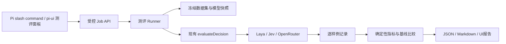

# Pi System One 测评插件：调研与实现方案

> 2026-10-06 实施状态：首批共享 runner、六例 smoke、Pi 命令、独立 companion、指标/持久化、比较与 UI 已落地。具体行为与后续范围见 [SYSTEM_ONE_EVAL.md](SYSTEM_ONE_EVAL.md)。120 例基准、bootstrap、导入/resume 和工作流 token 实验尚未实现。

日期：2026-10-06。状态：方案草案，本轮不实现、不提交、不推送。基于 pi-ui feat_system_one / bc86719，安装的 Pi 0.85.1，以及已接入的 System One HTTP/OpenRouter Decisions。

## 1. 目标与范围

“模型工作测评”有两种含义：测 System One 自身的决策能力；或用 System One 评判主 LLM/Agent 的工作。本方案默认前者为首批主线，第二种保留独立扩展，不能把同一模型自己的评分当作自己的客观成绩。

交付一个可在 Pi 命令行与 pi-ui 使用的扩展：用户选择版本化测试集和已配置的模型，确定性运行、暂停/取消、查看结果、比较基线。回答三个问题：接口是否可靠？对目标工作场景判断是否正确？放入流程后是否在质量约束下节省时间和主 LLM token？

首批：English/Multilingual Laya；Jev/OpenRouter 在提供凭据后使用同一测试集。测评不改变聊天模型、全局默认或项目选择。不依赖主 LLM生成测试题、启动评测或计算指标。

非目标：自动执行高风险操作、通用代码能力排行榜、以 System One 替代人工参考标签、自动部署与自动调参。尚无工作流筛选实现，因此首版不得宣称已证明 token 收益。

## 2. 仓库事实及可复用部分

- DecisionStore 管理 provider/model、revision 与凭据；evaluateDecision 验证三类题型、响应概率、超时和错误；broker 提供项目绑定授权与每provider两个并发槽。
- 当前 Pi 扩展只注册 system_one_evaluate；UI 的“测试模型”仅为连通性样例，不是效果测评。
- scripts/validate-laya.mjs 是四个有分类/二元标签的样例及20次英文计时，没有score参考等级，没有完整数据集规范、统计比较、持久任务和恢复机制。
- Laya English/Multilingual 都返回 laya-rl-agent；checkpoint必须通过配置 remoteModel、供应商routing、revision/health证据识别。不要把 model 字符串当作不可变权重身份。
- 既有E2E发现主LLM生成错误工具参数、执行额外write。这两类失败属于Agent流程行为指标，不能计入System One本身的分类错误。

## 3. 调研结论

Pi 0.85.1 本机 docs/extensions.md、docs/rpc.md 是本轮兼容性依据：registerCommand命令通过RPC prompt直达扩展，执行不必启动LLM；appendEntry记录不参与LLM上下文。sendMessage创建的custom message会进入LLM上下文，即使不触发新turn也会增加后续上下文，不能用它承载测评明细。hasUI在RPC也为true，TUI custom界面要另查ctx.mode，网页不能直接复用TUI renderer。

官方Laya已有版本化JSONL测试集、标签、切片、基线门禁与评测工具，适合参考数据集设计和做Laya结果交叉核验；它围绕Laya Python推理实现，不能直接承担我们的多provider HTTP统一runner。首批保留Node端确定性runner，不引入Python评测运行时依赖。

概率校准资料强调：Brier兼有校准与区分能力，不等于单一校准误差。Laya官方当前评测用answer_confidence计算部分指标，和原生confidence语义不等同。我们的跨provider指标应首先使用choice完整分布、noul原始P(yes)，其他confidence仅在语义声明成立时做独立分析。

## 4. 三层测评

| 层 | 测什么 | 判断依据 |
| --- | --- | --- |
| 协议与运行 | schema、支持能力、错误、取消、稳定性、延迟 | 确定性校验与固定fixture；供应商真实冒烟单列 |
| 决策效果 | 任务路由、相关性、紧急程度、条件识别 | 冻结人工标签，choice/score/noul按题型评分 |
| 工作流收益 | Baseline vs System One辅助流程 | 相同任务、实际主LLM usage、任务质量与返工 |

第三层需要真实流程adapter，如历史相关性筛选。插件提供paired experiment运行与结果契约，待流程实现后接入；不能把单次System One inference的usage当作主LLM节省量。

未来若测主LLM/Agent：先看测试通过、文件diff、工具轨迹、明确的完成条件；System One可辅助判定格式/路由/某项rubric，但需独立人工标注集验证该judge，有分歧时列出而非自动合成总分。

## 5. 插件与runner架构



测评插件是一层人触发入口，不新增默认可被LLM调用的“启动大批测评”工具。命令、HTTP adapter和网页共享同一个runner及计算内核。

建议模块：evaluation/contracts（schema与版本）、dataset（校验/规范化/hash）、runner（状态机/调度/取消）、metrics（纯函数）、reports（追加记录与导出）、pi-extension（命令与摘要），UI评测面板。仅因CLI/UI/两类真实协议的变化来源建立这些边界。

部署模式：

- pi-ui：Shell拥有测评jobs与凭据解析，Pi插件使用其受控回环服务。复用现有扩展加载路径及配置。
- 独立Pi：显式安装/加载同一插件包，由可信扩展启动随包发布的固定companion runner；凭据在companion解析。仅绑定127.0.0.1随机端口，关闭Pi时清理。禁止由数据集选择任意可执行脚本。缺companion资产明确unavailable。
- 两模式共用runner代码，避免实现两套评分。跨进程并发限制首版是每runner局部限制，不能宣称全机器全局限流。

现有/evaluate只接受state/questions且遵循当前项目选择，不为测评临时改变store.select。新增Job API接受用户明确选择的modelConfigIds，对每个模型解析一次冻结配置，并保持到job结束。使用不同scope的授权；普通决策工具token不得启动jobs、读其他run或更改模型选择。该token隔离只是API边界，不是对拥有bash的本机Agent进行OS隔离。

## 6. Pi 命令与 UI

建议注册一个命令，以子命令减少命令空间污染：

```text
/s1-eval suites
/s1-eval validate --suite routing-smoke-v1
/s1-eval run --suite work-decisions-v1 --models <id1>,<id2>
/s1-eval status <runId>
/s1-eval cancel <runId>
/s1-eval report <runId>
/s1-eval compare <runId> --baseline <runId>
```

只有run会请求模型。默认仅本地suite且调用预检后给出预算：模型数×样例数×重复数、endpoint、上限与可能计费；网页用“开始测评”按钮显式启动，CLI命令有明确run参数时即为启动授权，不再反复确认。默认最大200个HTTP请求、单模型串行、job最长15分钟、无自动重试；参数变更须在提交前显示。超上限拒绝，不静默裁掉样例。

命令收到run后返回runId及预算，后台任务不阻塞其他Pi命令；cancel显式取消所有尚未完成请求。ctx.signal在idle command可能undefined，所以job必须有自己的AbortController，不能假设Esc/普通聊天abort会取消评测。session_shutdown关闭所属jobs；普通关闭网页tab不取消Shell中的job，重新连接可查看。

插件用appendEntry写runId/状态/报告相对位置等小记录，UI通过ShellEvent获取进度，通过Job API读取报告。TUI使用status/notify及自定义entry renderer；不把整份报告sendMessage到聊天上下文。用户主动“让Agent分析报告”时才导入明确选定的摘要。

网页放在“决策配置 → 测评”入口：测试集/模型多选、预算预览、进度、取消、题型及语言切片、错误样例、基线比较与报告导出。最近连接测试和效果成绩区分显示。命令自动出现在现有Pi slash command候选，不另设独立命令解析器。

## 7. 数据集与首批场景

JSONL采用公开接口state/questions，与Laya结构相近但标识和版本由我们的manifest管理。数据集中禁止endpoint/apiKey/model覆盖与可执行代码，模型选择只由run spec提供。

```json
{"id":"route-zh-001","sourceGroup":"refund-01","language":"zh","tags":["routing","explicit"],"state":"我被重复扣款了，请退还多收的钱。","questions":{"team":{"type":"choice","instructions":"Which team handles this?","criteria":{"billing":"Payments and refunds","technical":"Software bugs"}}},"expected":{"team":{"type":"choice","label":"billing"}}}
```

expected按题型显式定义：choice单一label（存在于criteria）；noul boolean；score数值或经审阅的等级区间（0..K-1）。歧义样例须单独标注不可裁决/人工复核，退出硬accuracy分母并展示数量；不得临时靠模型输出来改标签。首版不混用多标签与单标签指标。

建议数据量是设计目标，尚未制作：6条smoke（3题型×2语言）；120条work-decisions（任务路由、上下文相关性、优先级、前置条件各30条，中文/英文均衡）。包含明确正负样例、否定、无关噪声、含糊边界、混合语言和“文本要求模型改变标签”的干扰。score须双人独立标注及冲突裁决，无法形成标签的样例只做定性分析。

训练/开发阈值集/固定holdout按sourceGroup隔离，翻译、同模板变体不跨集合。冻结标签策略、manifest SHA256、规范化question指纹、split seed。option-order robustness使用固定seed的额外轮次，计入预算且按原sourceGroup统计，不当作独立新增样本。

## 8. 指标：明确分母与语义

每个题型/语言/场景分别报告样本数，不生成单个混合排行榜分数。

- choice：accuracy、macro-F1、confusion matrix；完整分布multiclass Brier = mean(sum_k((p_k-y_k)^2))，采用未减半的0..2范围，metricVersion固定。缺类F1标出分母，不凭空补零。
- noul：阈值在dev集冻结，默认0.5；accuracy、precision/recall/F1，Brier = mean((P(yes)-y)^2)（0..1）。类别不齐时AUROC为N/A而非0。
- score：MAE、容差内比例；同等级数才能比较原始MAE，不同等级报告归一化MAE。标签区间采用到区间的距离，单独命名metric，不能与点标签MAE混用。
- ECE仅对可解释的正确率概率计算：choice用max(probabilities)对预测正确性，noul用max(p,1-p)对二元预测正确性；固定10等宽bins，记录每bin样本数，端点归属固定。score未定义离散正确事件前不算ECE。原confidence与answer_confidence原样保存，语义不明则不作为统一校准列。
- 稳定性：HTTP成功率、schema有效率、unsupported/not_run/timeout/error/cancel分布、重复预测一致率。accuracy_valid只在有效答案计算，同时accuracy_attempted把错误请求当失败，防止跳过失败提高成绩；取消job不提供可用于晋级的总成绩。
- 性能：冷启动、首推理、暖态分开。monotonic时钟的端到端request p50/p95（nearest rank），另报成功/失败/timeout数，超时不是被剔除的“快请求”。并发与串行不混表；批处理若未来加入，区分整批响应延迟与每决策摊销时间。
- 成本：供应商usage原样及可比较字段；费用只有官方cost字段或明确价格版本时计算，缺失为N/A。本地没有云API账单，不等于零算力成本。

paired比较按sourceGroup bootstrap给差值区间，冻结seed/重复次数；小样本slice标注“样本不足”。不跨dataset/prompt/metricVersion比较；硬件与checkpoint不可识别时，比较需显示不可严格复现。第三方公开成绩仅作背景，不与本机成绩同表争排名。

## 9. 工作流收益实验（第二阶段）

先选历史片段筛选：固定任务与候选片段、保留用户指令/项目规范/接口契约等mandatory上下文。Baseline送完整内容；Variant用System One筛候选，失败/不确定时回到Baseline；两臂固定主模型版本、提示与工具，隔离Pi session/cwd，用固定顺序交叉运行避免缓存/温度混淆。

系统一筛选增加的主LLM工具轮次、所有fallback/retry/compaction、缓存input/output及返工都算入usage。从实际assistant usage汇总，不用字符串长度伪装真实token。报告tokenSaving=1-totalMainTokens_variant/totalMainTokens_baseline，并分别展示input/output/cache；费用按cache价格单算。拒绝只统计成功任务来放大节省。

质量以事先冻结的任务验收（测试通过、必须事实召回、漏约束/误执行次数）为主，注明人工判定部分。先shadow记录筛选建议，不改变真实用户会话；离线paired replay过门禁后才考虑正式过滤。尚未实现workflow adapter时报告该层not_run。

## 10. Job与结果存储

状态：queued→running→completed/failed/cancelled；完成≠质量门禁通过。progress.completed包括success/error，不含not_run；status返回分项计数。每provider复用同一调度器，避免现在手动测试绕过broker槽位的差异；eval不饥饿阻塞交互决策，默认低优先级串行。

run开始冻结suite/hash、model config snapshot（不含密钥/credential值）、revision、remoteModel、adapter/metricVersion、package/git版本、语言/标签策略、seed、超时/重试规则与预算。服务返回routing/health能获取则记录，不伪造缺失checkpoint revision；endpoint去掉query中的敏感内容，明细由脱敏策略处理。

默认保存至getAgentDir()/pi-ui/evals/<runId>/：manifest.json、cases.jsonl、events.jsonl、report.json、report.md，0600权限。原始状态/答案仅对明确授权的本地测试集保存，不自动抓取用户聊天。UI展示结构化摘要而非任意HTML，导出需明确目录。

逐请求追加完成记录，最终报告原子写入；启动扫描running但无活进程的run标记interrupted。首版不自动resume/重发，因为可能二次计费；显式resume只重跑无完成记录的样例，并标记不确定已计费、重新冻结相容配置与原run关联。配置删除不破坏旧报告；运行中删除/变更不改变被冻结请求，密钥轮换只影响新run。

## 11. 公共接口草案

Job API：listSuites、validateSuite、startRun(runSpec)、getRun(runId)、cancelRun(runId)、getReport(runId)、compareRuns(candidate,baseline)。路径使用服务端注册suiteId与runId，不允许任意绝对文件读取。导入用户JSONL是单独的显式操作，校验大小/行数/UTF-8/schema/唯一id，禁用符号链接越界；先解析整份再开始调用，防止“前半计费、后半无效”。

RunSpec含suiteId/version、modelConfigIds、repeat、seed、deadline、purpose（decision/ workflow）；不含state/model endpoint/key。开始前预检模型能力、凭据状态和预算，缺某类型显示unsupported，不静默替换题型。精确的WS命令/HTTP路径留实施时根据现有路由收敛；错误码需包括budget_exceeded、dataset_invalid、incompatible_baseline、interrupted。

## 12. 实施顺序与验证

1. 纵向切片：6条有完整标签的smoke → 单个Laya配置 → /s1-eval run → JSON/Markdown报告；独立CLI也可运行，确认注册命令不触发聊天模型。
2. runner可靠性：持久任务、取消、请求预算、配置冻结、重连；真实协议与fixture共用公共接口。接入第二个真实协议前仍以OpenRouter固定fixture验证。
3. 指标/比较：固定算术样例TDD，再接120条数据集、切片与baseline；校验Brier缩放、分母、ties、全错/无有效结果等边界。
4. pi-ui端到端：从模型配置发起、观察进度、取消/重连、查看失败样例与导出；TUI/RPC分别验证，不把TUI显示能力当网页已实现。
5. workflow paired adapter：shadow筛选 → 离线两臂真实LLM → token/质量报告；单独验收，不因阶段1通过自动上线过滤。

计划验证命令：npm run check、npm run build；新增CLI eval validate/run/compare（名称实施时确定）。fixture CI不下载权重、不访问云、无需secret；real suite为显式本地任务，环境缺失列not_run。取消测试必须确认没有额外请求/孤儿job；报告重算不调用provider且结果与固定答案一致。

验收门禁：首版工程路径全部通过、报告可由保存答案重算、不同模型能力缺失不伪装成绩、配置/凭据不泄漏、命令无意外LLM turn、TUI/RPC都可取消。质量阈值需在看holdout前从dev集冻结；首版不预设所有模型90%或全平台100ms。工作流收益只有quality noninferiority达到预置容差且paired token/耗时结果支持时才能宣称提升。

## 13. 决策与未定项

推荐：自有Node runner + 共享HTTP adapters；Laya官方eval仅用于交叉验证；人触发Pi slash command；主进程/companion任务执行；测评明细不进入LLM上下文；确定性标签优先。备选“让主Agent逐题调工具”会混合模型参数错误/额外工具行为并增加LLMtoken，不适合作为决策模型本体测评主路径，但保留为Agent工作流单独测试。

待确认：主要测System One自身、还是以它辅助测LLM/Agent（本方案已分层）；首批业务场景标签的负责人；是否需要导入真实脱敏会话；云调用预算。未确认不阻塞本地smoke与框架设计，真实会话导入/云批量调用不默认开启。

## 14. 一手来源与版本限制

- Pi本机0.85.1：安装包docs/extensions.md、docs/rpc.md（registerCommand、appendEntry、RPC命令分派、UI模式）；实施必须对安装版本做真实probe，不能只按旧mariozechner命名写SDK导入。
- [Laya官方评测说明](https://github.com/NandhaKishorM/laya/blob/main/docs/evals.md)：JSONL标签、切片、基线、timing；查阅2026-10-06，main会变动，实施需固定commit并与安装0.3.27核对。
- [Laya官方评测源码](https://github.com/NandhaKishorM/laya/blob/main/laya/evals.py)：作为指标实现交叉审查来源，不复制其实时成绩为我们的结果。
- [Laya官方benchmark说明](https://github.com/NandhaKishorM/laya/blob/main/BENCHMARKS.md)：比较前需区分不同样本/提示与第三方成绩。
- [scikit-learn概率校准说明](https://scikit-learn.org/stable/modules/calibration.html)、[Brier指标定义](https://scikit-learn.org/1.8/modules/generated/sklearn.metrics.brier_score_loss.html)：概率指标含义与binary/multiclass缩放区别。

本次检查：基线/工作区只读核对；方案覆盖Standards与Spec两轴。尚未写插件、测试集或执行模型测评，不把上述计划指标/数据量当作已有实测。
